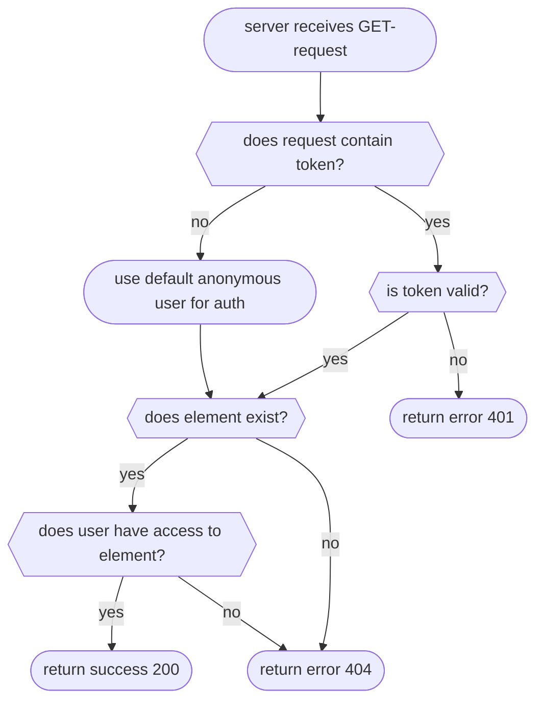

# GET /&lt;uuid&gt;

```mermaid
%%{init: {'flowchart' : {'curve' : 'monotone'}}}%%

graph TB
  init([server receives GET-request])
  checkToken{{does request contain token?}}
  noTokenAction([use default anonymous user for auth])
  checkTokenValidity{{is token valid?}}
  checkElementExistence{{does element exist?}}
  checkElementAccess{{does user have access to element?}}
  
  error401([return error 401])
  error404([return error 404])
  success200([return success 200])
  
  class init init
  class error401 status4xx
  class error404 status4xx
  class success200 status2xx
  
  init --> checkToken
  checkToken -- no --> noTokenAction
  checkToken -- yes --> checkTokenValidity
  noTokenAction --> checkElementExistence
  checkTokenValidity -- no --> error401
  checkTokenValidity -- yes --> checkElementExistence
  checkElementExistence -- yes --> checkElementAccess
  checkElementAccess -- yes --> success200
  checkElementAccess -- no --> error404
  checkElementExistence -- no --> error404
```

