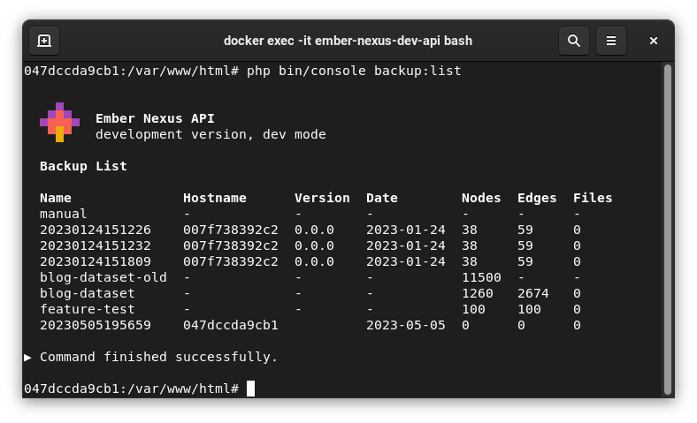
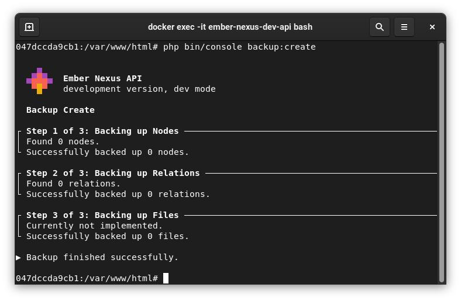
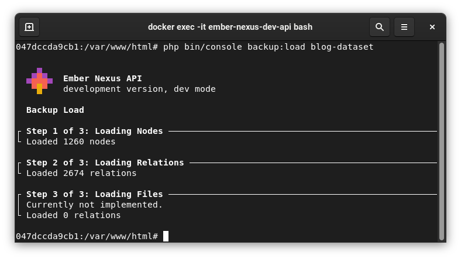

# Database

## Backup List

Lists all available backups. Backups are stored in `./var/backup/`.

```bash
php bin/console backup:list
```



## Backup Create

Creates a new backup. Backups are stored in `./var/backup/`.

```bash
php bin/console backup:create
```




## Backup Load

Loads a backup. Database must be empty.

```bash
php bin/console backup:load
```


