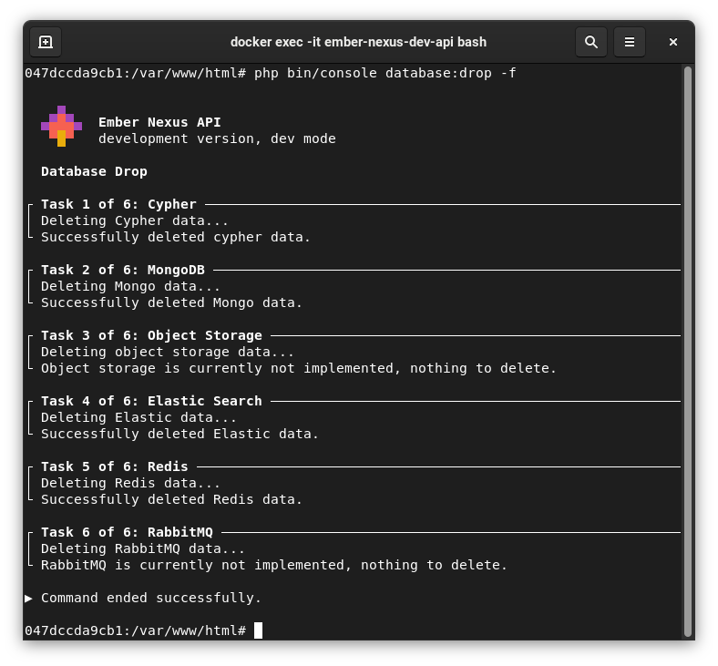

# Database

## Database Drop

The database drop command deletes all content of all connected databases. Useful for prototyping, dangerous in
production systems.

```bash
php bin/console database-drop
```


