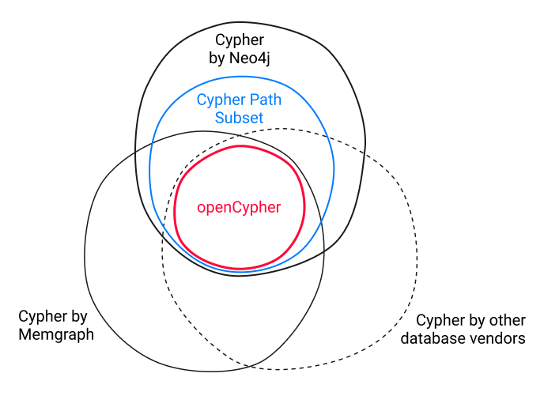

# Grammars

Grammar files define the syntax, rules and features of technical languages. While additional limits and restrictions may
apply, grammar files can give you a good idea of what is fundamentally supported in a language.

Within the Ember Nexus API we expose the following languages:

## Cypher

The Cypher query language is available in different variants.  
While Ember Nexus mostly uses openCypher, it uses extended variants when necessary.

### openCypher 9

A standardized set of core features, supported by many graph databases.

Ember Nexus tries to restrict its own graph queries to openCypher such that it is graph database agnostic, although this
is not always possible.

Links:

- [Project website](https://opencypher.org/)
- [openCypher grammar resources (original)](https://opencypher.org/resources/)
- [openCypher ANTLR grammar (copy)](https://github.com/ember-nexus/api/tree/main/antlr/src/openCypher9.g4)
- [openCypher railroad diagram (copy)](https://ember-nexus.github.io/api/antlr/open-cypher-9.html)

### Cypher 25

Neo4j's own Cypher variant, extends openCypher with their own features, graph pattern matching, GQL style features and
more.

Links:

- [Cypher documentation](https://neo4j.com/docs/getting-started/cypher/)
- [Cypher 25 railroad diagram (copy)](https://ember-nexus.github.io/api/antlr/cypher-25.html)
- [Cypher 25 ANTLR grammar (copy)](https://github.com/ember-nexus/api/tree/main/antlr/src/Cypher25Parser.g4)
- [Cypher 25 ANTLR grammar (original)](https://github.com/neo4j/neo4j/tree/release/5.26.0/community/cypher/front-end/parser/v25/parser/src/main/antlr4/org/neo4j/cypher/internal/parser/v25)

### Cypher Path Subset

Ember Nexus' own Cypher variant, also called "safe Cypher". It is a query language based on Cypher 25, where potentially
problematic features, keywords etc. were removed. The remaining query language still contains many features to support
graph search, without risks like data leakage or non-readonly queries.

The Cypher Path Subset might be aligned to be more database agnostic in the future.

Links:

- [Cypher Path Subset railroad diagram](https://ember-nexus.github.io/api/antlr/cypher-path-subset.html)
- [Cypher Path Subset ANTLR grammar](https://github.com/ember-nexus/api/tree/main/antlr/src/CypherPathSubset.g4)

### GQL

GQL, which stands for graph query language, is an official graph database query language standard. It will likely
replace openCypher at some point. While Ember Nexus does not yet use GQL internally, we will likely switch to it once it is adopted across multiple graph
databases.

Links:

- [GQL grammar files](https://github.com/opengql/railroad)
- [GQL railroad diagrams](https://opengql.github.io/railroad/)

## Elasticsearch

### Elasticsearch Query DSL

We are not yet aware of any grammar files for the Elasticsearch Query DSL.  
Reading their [documentation](https://www.elastic.co/docs/explore-analyze/query-filter/languages/querydsl) is likely the
closest way towards a language definition.

### Elasticsearch ES|QL

We will likely add support for ES|QL in the near future.

Links:

- [ES|QL documentation](https://www.elastic.co/docs/reference/query-languages/esql/esql-getting-started)
- [ES|QL ANTLR grammar files](https://github.com/elastic/elasticsearch/tree/main/x-pack/plugin/esql/src/main/antlr)

## Expr

[Expr](https://github.com/expr-lang/expr) is an expression library, used within Ember Nexus to manipulate data in search
queries.

Expressions need to be defined as strings surrounded by two curly brackets, e.g. `{{your_expression}}`, and their result
will replace the expression string inside queries. The replaced value can be a string itself, but also all other JSON
data types like numbers, arrays and objects are supported.

**Expressions are not supported in all locations of search requests**; see the relevant search step documentation for
more information.

> [!SECURITY]
> Expressions can be deactivated and expression strings are limited to a length of 10kb. Expressions longer than 512
> characters are furthermore logged.  
> You can change these settings in [Ember Nexus's configuration](/getting-started/configuration).

Links:

- [Expr library's language documentation](https://expr-lang.org/docs/language-definition)
- [Playground to test your own queries](https://expr-lang.org/playground)
