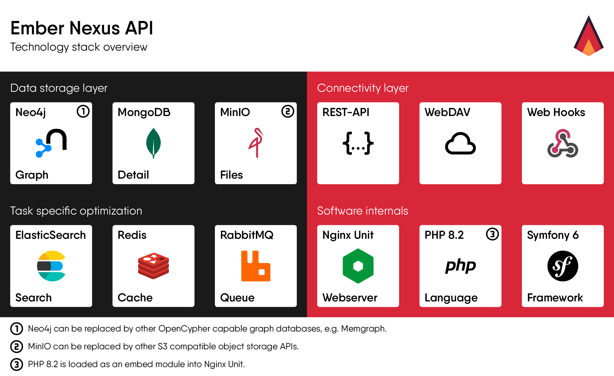

# Tech Stack

Ember Nexus API is powered by a powerful tech stack, consisting of six different databases, each chosen for its unique
advantages:

- **Neo4j**: As the industry-leading graph database, Neo4j is used as the primary data store for Ember Nexus API,
  allowing for flexible and efficient storage and retrieval of data.
- **MongoDB**: Another industry-leading database, MongoDB complements Neo4j by allowing for storage of complex data
  (JSON) within individual records.
- **MinIO**: Ember Nexus API utilizes MinIO, the best self-hosted S3-compatible object store, for managing uploaded
  files in a secure and scalable manner.
- **ElasticSearch**: As the industry-leading search engine, ElasticSearch provides powerful search capabilities to
  Ember Nexus API, allowing for near real-time full-text search functionality.
- **Redis**: Ember Nexus API employs Redis, an industry-leading key-value store, for caching to speed up operations
  and reduce load times.
- **RabbitMQ**: One of the industry-leading queue management systems, RabbitMQ is used for asynchronous event handling
  in Ember Nexus API.

It's worth noting that all the databases utilized by Ember Nexus API support clustering and horizontal scaling, making
it possible to scale the entire stack as needed to meet growing demands.
